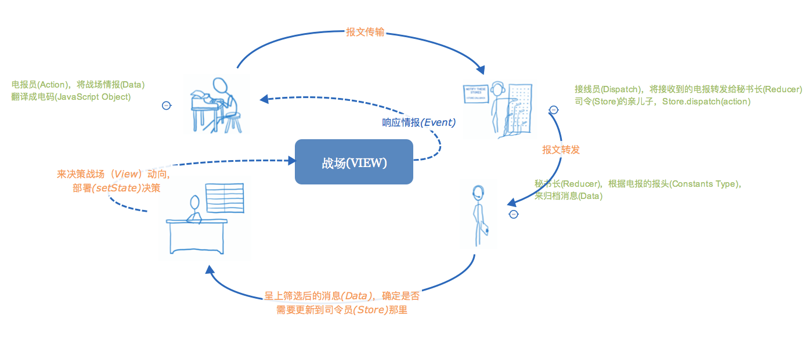
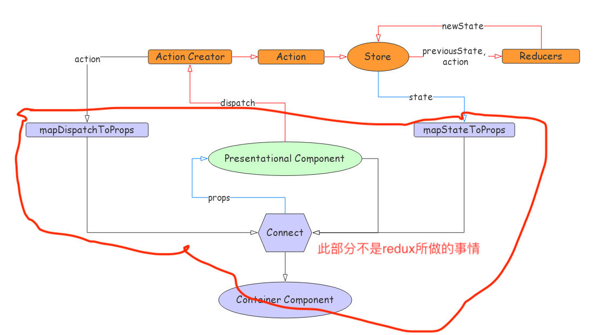

## 玄说前端面试层层解析—关于 redux 的源码

此篇文章是 redux 系列的第二篇，上一篇关于面试题的文章，请看：
[玄说前端面试层层提问—关于 redux 的面试题]()

面试题中，有很多需要清楚 redux 内部究竟是怎么样的，今天就一起来看个明白！

首先，你需要知道几件事情：

> 1.redux 和 react 是没有任何关系的，redux 只是一个状态管理器，它也可以用到 Vue 里  
> 2.connect 是属于 react-redux 的，react-redux 是连接 redux 和 react 的一个库

### 今日解析

概括一点：redux 就是一个状态管理器，那到底什么是状态管理器呢？

#### 1.实现一个简单的状态管理器

比如计数器中的 number，如下代码：

```javascript
let state = {
  number: 1
};
```

使用状态的时候通过`state.number`,比如修改状态的时候`state.number=2`, 这样修改 number 会有一个问题，使用到 number 的地方收不到通知，这里我们使用发布订阅模式来解决这个问题。  
代码这样处理：

```javascript
let state = {
  number: 1
};
let listeners = [];

/**订阅*/
function subscribe(listener) {
  listeners.push(listener);
}

/**改变number的时候*/
function changeNumber(number) {
  state.number = number;
  /**通知所有订阅者*/
  for (let i = 0; i < listeners.length; i++) {
    const listener = listeners[i];
    listener();
  }
}
```

这个时候，咱们先来尝试一下这个计数状态管理器。

```javascript
/**订阅*/
subscribe(() => {
  console.log(state.number);
});

/**通过changeNumber改变*/
changeNumber(2);
```

现在可以观察到，修改 number 的时候，订阅的方法会触发，打印出相应的 number 的值。但是现在有几个问题咱们需要面对一下：

> 1.这个状态管理器只能管理 number，不能通用  
> 2.公共的代码没有封装起来

咱们把公用的代码封装起来：

```javascript
/**
 * initState 初始状态
 */
const createStore = function(initState) {
  let state = initState;
  let listeners = [];

  /**订阅*/
  function subscribe(listener) {
    listeners.push(listener);
  }

  function changeState(newState) {
    state = newState;
    /**通知*/
    for (let i = 0; i < listeners.length; i++) {
      const listener = listeners[i];
      listener();
    }
  }
  /**获取当前状态*/
  function getState() {
    return state;
  }
  /**返回所有封装的方法*/
  return { subscribe, changeState, getState };
};
```

咱们现在来试试这个状态管理来管理多个状态 counter 和 info ；

```javascript
/**初始数据*/
let initState = {
  counter: {
    count: 1
  },
  info: {
    name: "",
    description: ""
  }
};
/**初始化store，传入初始状态*/
let store = createStore(initState);

/**订阅*/
store.subscribe(() => {
  let state = store.getState();
  console.log(`${state.info.name}：${state.info.description}`);
});
store.subscribe(() => {
  let state = store.getState();
  console.log(state.counter.count);
});

/**通过changeState方法改变数据info*/
store.changeState({
  ...store.getState(),
  info: {
    name: "玄说前端",
    description: "专注前端的公众号"
  }
});

/**通过changeState方法改变数据counter*/
store.changeState({
  ...store.getState(),
  counter: {
    count: 2
  }
});
```

到目前，咱们已经完成了一个简单的状态管理器。
在 createStore 中，提供了三个方法，改变状态的方法 changeState，获取当前状态的方法 getState，订阅状态发生改变的方法 subscribe

#### 2.实现一个有计划的状态管理器

很多同学会非常迷惑，这个有计划是什么意思？且听我细细道来。  
我们基于上面的状态管理器来实现一个自增，自减的计数器。

```javascript
let initState = {
  count: 0
};
let store = createStore(initState);

/**监听*/
store.subscribe(() => {
  let state = store.getState();
  console.log(state.count);
});

/*自增===>功能正常*/
store.changeState({
  count: store.getState().count + 1
});
/*自减===>功能正常*/
store.changeState({
  count: store.getState().count - 1
});

/*此处我这么来一下子，一脸懵逼*/
store.changeState({
  count: "玄说"
});
```

这个代码中，有一个问题，就是 count 被随意改成了字符串`玄说`,我们对于 count 的修改没有任何约束，它可以被改成任何值，任何地方都可以修改。这样在程序就变得不可维护了。  
此时我们需要约束 count，不允许随意修改 count 的值，只允许 count 自增或者自减。

两步来解决这个问题：

> 1.初始化 store 的时候，让他知道我们的修改计划是什么，制定一个 state 的修改计划。  
> 2.修改 store.changeState 方法，让他在修改 state 的时候，按照我们的计划来修改

这样我们来制定一个 state 的修改计划，命名为 plan 函数，它接受现在的 state 和一个我们需要它按照修改的计划名称 action，返回一个改变之后的 state。

```javascript
/*注意：action = {type:'',other:''}, action 必须有一个 type 属性,表明我们的计划*/
function plan(state, action) {
  switch (action.type) {
    case "INCREMENT":
      return {
        ...state,
        count: state.count + 1
      };
    case "DECREMENT":
      return {
        ...state,
        count: state.count - 1
      };
    default:
      return state;
  }
}
```

现在已经创建好了一个按照意愿来修改的计划，把计划告诉 store，store.changeState 就会按照计划来修改。

修改一下之前的`createStore`

```javascript
/*增加一个参数 plan*/
const createStore = function(plan, initState) {
  let state = initState;
  let listeners = [];

  function subscribe(listener) {
    listeners.push(listener);
  }

  /*给changeState传入要修改的计划*/
  function changeState(action) {
    /*按照计划来修改 state*/
    state = plan(state, action);
    for (let i = 0; i < listeners.length; i++) {
      const listener = listeners[i];
      listener();
    }
  }

  function getState() {
    return state;
  }
  return {
    subscribe,
    changeState,
    getState
  };
};
```

现在再来试一下行的 createStore 实现的自增和自减：

```javascript
let initState = {
  count: 0
};
/*传入一开始定义的plan*/
let store = createStore(plan, initState);

/**监听*/
store.subscribe(() => {
  let state = store.getState();
  console.log(state.count);
});

/*自增*/
store.changeState({
  type: "INCREMENT"
});

/*自减*/
store.changeState({
  type: "DECREMENT"
});

/*传入无效的计划或者值类型，不会修改原state*/
store.changeState({
  count: "abc"
});
```

这样就实现了一个有计划的状态管理器；  
到这一步基本的模型就已经实现了，把 plan 的名字修改成 reducer，changeState 修改成 dispatch，这样和 redux 的叫法就一样了。

#### reducer 的处理

但是现在还存在一个问题，reducer 是一个计划函数，接受的是老的 state，一般在项目中有大量 state，每一个 state 的修改，都需要计划函数，如果所有的计划都写在一个 reducer 函数里面，这样就显得很繁杂，也不好理解。  
我们可以按照组件的维度来拆分出多个 reducer 函数，然后通过一个合并函数，把所有的 reducer 合并到一起。比如现在有两个 state，counter 和 info。

```javascript
let state = {
  counter: {
    count: 1
  },
  info: {
    name: "玄说前端",
    description: "前端公众号"
  }
};
```

拆分成两个 reducer，counterReducer 和 infoReducer。

```javascript
/**
 * counterReducer
 */
//这个reducer需要接受的数据是state状态里面的state.counter！！！！！
function counterReducer(state, action) {
  switch (action.type) {
    case "INCREMENT":
      return {
        count: state.count + 1
      };
    case "DECREMENT":
      return {
        ...state,
        count: state.count - 1
      };
    default:
      return state;
  }
}

/**
 * infoReducer
 */
//这个reducer需要接受的数据是state状态里面的state.info！！！！！
function infoReducer(state, action) {
  switch (action.type) {
    case "SET_NAME":
      return {
        ...state,
        name: action.name
      };
    case "SET_DESCRIPTION":
      return {
        ...state,
        description: action.description
      };
    default:
      return state;
  }
}
```

现在把两个 reducer 通过一个函数把他合并起来，我们把这个函数叫做 combineReducers，一般它是这么用的，传入一个对象，对象包含所有的 reducer，它的 key 值对应 state 的 key 值是一样的：

```javascript
const reducer = combineReducers({
  counter: counterReducer,
  info: infoReducer
});
```

基于用法，需要返回一个合并的 reducer，执行完成之后，传入 state 状态和计划，可以返回一个新的 state，我们来实现以下：

```javascript
/**传入一个包含多个reducer的对象*/
function combineReducers(reducers) {
  /* 获取传入对象所有的key，reducerKeys = ['counter', 'info']*/
  const reducerKeys = Object.keys(reducers);

  /*返回一个合并后的新的reducer函数，接受state和action参数*/
  return function combination(state = {}, action) {
    /*初始化一个新的state*/
    const nextState = {};

    /*遍历循环执行所有的reducer，整合所有的state为一个新的*/
    for (let i = 0; i < reducerKeys.length; i++) {
      const key = reducerKeys[i];
      /*获取当前循环的reducer*/
      const reducer = reducers[key];
      /*传入的reducer对象的key和总的state的key一样。所以通过key值，获取reducer对应要改变的state*/
      const previousStateSingle = state[key];
      /*执行 当前循环的reducer，生成新的state*/
      const nextStateSingle = reducer(previousStateSingle, action);

      /**每一个新的state通过key，生成新的总的state*/
      nextState[key] = nextStateSingle;
    }
    return nextState;
  };
}
```

至此，我们已经完成了 combineReducers，来试验一下：

```javascript
const reducer = combineReducers({
  counter: counterReducer,
  info: InfoReducer
});
let state = {
  counter: {
    count: 1
  },
  info: {
    name: "玄说前端",
    description: "前端公众号"
  }
};
/**生成store*/
let store = createStore(reducer, initState);

/**监听修改*/
store.subscribe(() => {
  /**获取新的state*/
  let { counter, info } = store.getState();
  console.log(counter.count, info.name, info.description);
});

/*自增*/
store.dispatch({
  type: "DECREMENT"
});

/*修改 description*/
store.dispatch({
  type: "SET_DESCRIPTION",
  description: "我爱看玄说前端"
});
```

至此，reducer 拆分逻辑已经完成，在业务中只需要每个组件管理自己的状态，后面再通过合并就好。

#### state 的整合

就目前来看还存在一个问题（怎么特么这么多问题呀，我也没有办法，层层深入呗 😭），state 所有的还写在一起的，这样每个组件的业务管理 state 还是有点点难维护，基于上面对于 reducer 按照组件的维度来拆分的逻辑，我们也在这个维度来做拆掉。

---

在业务中的时候这样写：

```javascript
/**把每一个reducer所有修改的状态，单独和这个reducer写在一起*/
/**比如上面的counter*/
//单个的state
let initState = {
  count: 1
};
//所对应的reducer
function counterReducer(state, action) {
  /*注意：如果参数 state 没有初始值，那就给他初始值！！*/
  if (!state) {
    state = initState;
  }
  switch (action.type) {
    case "INCREMENT":
      return {
        count: state.count + 1
      };
    default:
      return state;
  }
}
```

所有单个的状态 state，需要在一个地方我们把它整合成一个，这个最好的地方就是在 createStore 里面：

```javascript
const createStore = function(reducer, initState) {
  let state = initState;
  let listeners = [];

  function subscribe(listener) {
    listeners.push(listener);
  }

  function dispatch(action) {
    state = reducer(state, action);
    for (let i = 0; i < listeners.length; i++) {
      const listener = listeners[i];
      listener();
    }
  }

  function getState() {
    return state;
  }
  /**只是在此处增加了一行，通过一个不匹配任何计划的 type，来获取初始值*/
  dispatch({ type: Symbol() });

  return {
    subscribe,
    dispatch,
    getState
  };
};
```

这样在 createStore 被调用的时候，不匹配任何 action，每一个 reducer 就会返回初始化的 state，合并 reducer 的时候，就把所有的 state 整合到了一起。
基于上面的 reducer，来试试下面的这个情况：

```javascript
/*不传入初始化state */
const store = createStore(reducer);
/*获取state*/
console.log(store.getState());
```

到目前为止，redux 里面基本的 reducer，createStore，combineReducers 等方法已经实现的差不多了。但是还有一个特别重要的东西—**中间件**

#### middleware 中间件的构成

**什么是中间件？**

> 1.  将具体业务和底层逻辑解耦的组件。
> 2.  数据从底层到应用端的中转站。

有点懵逼 😳！！！！  
在 redux 中，中间件就是对 dispatch 的重写或者说扩展，增强 dispatch 的功能，redux 的 dispatch 是发送一个计划给 reducer 让它来改变 state 状态的，那么中间件的加入就是在 disptach 发送计划的过程中，还能让他做点其他的事情。在这个维度上做的扩展就是中间件的作用。

**记录日志的中间件**  
目前有一个需求，需要在每次修改 state 的时候，记录修改前的 state，修改后的 state，为什么修改，这个时候就需要对 dispatch 来做扩展了：

```javascript
const store = createStore(reducer);
/*暂存之前的dispatch函数*/
const next = store.dispatch;

/**重写store.dispatch*/
store.dispatch = action => {
  console.log("当前state", store.getState());
  console.log("修改原因", action);
  //调用之前的dispatch
  next(action);
  console.log("修改后的state", store.getState());
};
```

执行一下：

```javascript
store.dispatch({
  type: "INCREMENT"
});
```

结果：

```javascript
当前state { counter: { count: 1 } }
action { type: 'INCREMENT' }
2
修改后的state { counter: { count: 2 } }
```

这样，日志的收集就已经做好了。

**记录异常的中间件**  
程序中，一般都会有记录异常原因的需求，这个时候也需要扩展一下 dispatch

```javascript
const store = createStore(reducer);
const next = store.dispatch;

store.dispatch = action => {
  try {
    next(action);
  } catch (err) {
    console.error("错误报告: ", err);
  }
};
```

**多个中间件功能都需要**  
现在记录日志和异常的功能都需要，可以这么写，两个函数合起来：

```javascript
store.dispatch = action => {
  try {
    console.log("当前state", store.getState());
    console.log("修改原因", action);
    //调用之前的dispatch
    next(action);
    console.log("修改后的state", store.getState());
  } catch (err) {
    console.error("错误报告: ", err);
  }
};
```

完美，漂亮，多么美丽 😄😄😄😄！！！

这个时候 SB 产品跑过来说，我需要在点击某个按钮的时候，dispatch 的时候，看看当前的时间时间是多少，那就继续改呗，5 个需求改五次原有的 dispatch 函数 😳，这样后面 dispatch 会变得特别庞大，维护起来特别困难，所以这样是不行的！

那就采取一个来实现多个中间件融合的方式：

> 第一步.把打印日志的中间件提取出来叫做 loggerMiddleware

```javascript
const store = createStore(reducer);
const next = store.dispatch;

/**提取*/
const loggerMiddleware = action => {
  console.log("this state", store.getState());
  console.log("action", action);
  next(action);
  console.log("next state", store.getState());
};
/**重写*/
store.dispatch = action => {
  try {
    loggerMiddleware(action);
  } catch (err) {
    console.error("错误报告: ", err);
  }
};
```

> 第二步.把错误异常的中间件提取出来

```javascript
const exceptionMiddleware = action => {
  try {
    /*next(action)*/
    loggerMiddleware(action);
  } catch (err) {
    console.error("错误报告: ", err);
  }
};
store.dispatch = exceptionMiddleware;
```

> 第三步，此时 exceptionMiddleware 错误异常的中间件里面写定了 loggerMiddleware 日志处理的中间件，这肯定是不行，需要变成一个动态的中间件，我们通过函数传参来解决这个问题

```javascript
const exceptionMiddleware = next => action => {
  try {
    /*loggerMiddleware(action);*/
    next(action);
  } catch (err) {
    console.error("错误报告: ", err);
  }
};
/*loggerMiddleware 变成参数传进去*/
store.dispatch = exceptionMiddleware(loggerMiddleware);
```

> 第四步，loggerMiddleware 里面的 next 现在是等于 store.dispatch，导致 loggerMiddleware 里面无法扩展别的中间件了！我们这里把 next 写成动态的，通过函数来传递。

```javascript
const loggerMiddleware = next => action => {
  console.log("this state", store.getState());
  console.log("action", action);
  next(action);
  console.log("next state", store.getState());
};
```

此时，我们摸索出来了一个比较不错的中间件合作模式：

```javascript
const store = createStore(reducer);
const next = store.dispatch;

const loggerMiddleware = next => action => {
  console.log("this state", store.getState());
  console.log("action", action);
  next(action);
  console.log("next state", store.getState());
};

const exceptionMiddleware = next => action => {
  try {
    next(action);
  } catch (err) {
    console.error("错误报告: ", err);
  }
};

/**通过一层层的执行*/
store.dispatch = exceptionMiddleware(loggerMiddleware(next));
```

但是现在会有个问题，因为中间件很多都是第三方扩展的，属于外部文件，比如 loggerMiddleware 中包含了变量 store，此时外部文件是没有这个变量的，所以也需要把 store 作为参数传进来，这样中间件的模式就变成了这样：

```javascript
const store = createStore(reducer);
const next = store.dispatch;

const loggerMiddleware = store => next => action => {
  console.log("this state", store.getState());
  console.log("action", action);
  next(action);
  console.log("next state", store.getState());
};

const exceptionMiddleware = store => next => action => {
  try {
    next(action);
  } catch (err) {
    console.error("错误报告: ", err);
  }
};

/**传入store，生成包含了store变量的中间件 */
const logger = loggerMiddleware(store);
const exception = exceptionMiddleware(store);
/**依次调用，传入中间件*/
store.dispatch = exception(logger(next));
```

到这里为止，我们真正的实现了两个可以独立的中间件啦！  
但是要记住上面，咱们还有一个产品提出的需求，在 dispatch 的时候，打印日志前，记录时间，我们来实现一下：

```javascript
const timeMiddleware = store => next => action => {
  console.log("time", new Date().getTime());
  next(action);
};
```

如同上面的方法，调用一下试试

```javascript
const time = timeMiddleware(store);
store.dispatch = exception(time(logger(next)));
```

#### 优化中间件的使用方式

上面实现的中间件使用方式不是特别友好，需要一层一层传入执行：

```javascript
import loggerMiddleware from "./middlewares/loggerMiddleware";
import exceptionMiddleware from "./middlewares/exceptionMiddleware";
import timeMiddleware from "./middlewares/timeMiddleware";

const store = createStore(reducer);
const next = store.dispatch;

const logger = loggerMiddleware(store);
const exception = exceptionMiddleware(store);
const time = timeMiddleware(store);
//层层传递执行
store.dispatch = exception(time(logger(next)));
```

既然知道了三个中间件，其他的细节是不是可以封装起来呢？咱们希望使用的时候是这样的：

```javascript
/*传入多个中间件，接收旧的 createStore，返回新的 createStore*/
const newCreateStore = applyMiddleware(
  exceptionMiddleware,
  timeMiddleware,
  loggerMiddleware
)(createStore);

/*返回了一个 dispatch 被重写过的 store*/
const store = newCreateStore(reducer);
```

内部封装逻辑在 applyMiddleware 中实现：

```javascript
/**接受所有的中间件*/
const applyMiddleware = function(...middlewares) {
  /*返回一个重写createStore的方法，接受之前的createStore*/
  return function rewriteCreateStoreFunc(oldCreateStore) {
    /*返回重写后新的 createStore*/
    return function newCreateStore(reducer, initState) {
      /*用之前的createStore生成store*/
      const store = oldCreateStore(reducer, initState);

      /*
       * 给每个 middleware 传下store，
       * 相当于 const logger = loggerMiddleware(store);
       */

      /*
       * 返回传入store执行之后的所有中间件
       * const chain = [exception, time, logger]
       */
      const chain = middlewares.map(middleware => middleware(store));

      let dispatch = store.dispatch;
      /* 实现 exception(time((logger(dispatch))))*/
      chain.reverse().map(middleware => {
        dispatch = middleware(dispatch);
      });

      /*2. 重写 dispatch*/
      store.dispatch = dispatch;
      return store;
    };
  };
};
```

基于这一步中间件合作改造的工作已经差不多了，但是还有一些小问题，有了两个 createStore：

```javascript
/*没有中间件的 createStore*/
import { createStore } from "./redux";
const store = createStore(reducer, initState);
```

---

```javascript
/*有中间件的 createStore*/
const rewriteCreateStoreFunc = applyMiddleware(
  exceptionMiddleware,
  timeMiddleware,
  loggerMiddleware
);
const newCreateStore = rewriteCreateStoreFunc(createStore);
const store = newCreateStore(reducer, initState);

//这里会有newCreateStore和createStore这两个，这样对于用户而言，是不好区分的。
```

这里在修改一下 createStore：

```javascript
const createStore = (reducer, initState, rewriteCreateStoreFunc) => {
  /*如果有 rewriteCreateStoreFunc，那就采用新的 createStore */
  if (rewriteCreateStoreFunc) {
    const newCreateStore = rewriteCreateStoreFunc(createStore);
    return newCreateStore(reducer, initState);
  }
  /*否则按照正常的流程走*/
};
```

最终的用法：

```javascript
const rewriteCreateStoreFunc = applyMiddleware(
  exceptionMiddleware,
  timeMiddleware,
  loggerMiddleware
);

const store = createStore(reducer, initState, rewriteCreateStoreFunc);
```

#### 退订事件注册

修改一下 subscribe,增加退订的方法

```javascript
function subscribe(listener) {
  listeners.push(listener);
  return function unsubscribe() {
    const index = listeners.indexOf(listener);
    listeners.splice(index, 1);
  };
}
```

使用：

```javascript
const unsubscribe = store.subscribe(() => {
  let state = store.getState();
  console.log(state.counter.count);
});
/*退订*/
unsubscribe();
```

#### 目前中间件可以拿到我们完成的 store

到目前，applyMiddleware 方法中的 store 可以被中间件拿到，我们只把 getState 方法传递给中间件就好。
修改下 applyMiddleware 中给中间件传的 store：

```javascript
/*
 * 以前是这样的：
 * const chain = middlewares.map(middleware => middleware(store));
 */
const onlyGetStore = { getState: store.getState };
const chain = middlewares.map(middleware => middleware(onlyGetStore));
```

**compose**  
我们的 applyMiddleware 中，把 [A, B, C] 转换成 A(B(C(next)))，是这样实现的

```javascript
const chain = [A, B, C];
let dispatch = store.dispatch;
chain.reverse().map(middleware => {
  dispatch = middleware(dispatch);
});
```

其实在 redux 中提供了一个 compose 方法，可以这样做：

```javascript
const chain = [A, B, C];
dispatch = compose(...chain)(store.dispatch);
```

它的内部实现如下：

```javascript
export default function compose(...funcs) {
  if (funcs.length === 1) {
    return funcs[0];
  }
  return funcs.reduce((a, b) => (...args) => a(b(...args)));
}
```

这个函数属于函数式编程中的组合的概念，有兴趣，我们后面单开一节，讲讲函数式编程。

#### 省略 initState

在 redux 中有时候 createStore 的时候，没有传 initState，允许我们这么写：

```javascript
const store = createStore(reducer, rewriteCreateStoreFunc);
```

它的内部做了这么一层实现：

```javascript
function craeteStore(reducer, initState, rewriteCreateStoreFunc) {
  if (typeof initState === "function") {
    rewriteCreateStoreFunc = initState;
    initState = undefined;
  }
  /**其他代码*/
}
```

#### 按需加载 reducer

reducer 做了拆分之后，和 UI 组件是一一对应的，在做按需加载的时候，reducer 也可以和组件一起做按需加载，用新的 reducer 替换老的 reducer：

```javascript
const createStore = function(reducer, initState) {
  function replaceReducer(nextReducer) {
    reducer = nextReducer;
    /*刷新一遍 state 的值，新来的 reducer 把自己的默认状态放到 state 树上去*/
    dispatch({ type: Symbol() });
  }
  //其他代码
  return {
    ...replaceReducer
  };
};
```

使用的例子：

```javascript
const reducer = combineReducers({
  counter: counterReducer
});
const store = createStore(reducer);

/*生成新的reducer*/
const nextReducer = combineReducers({
  counter: counterReducer,
  info: infoReducer
});
/*replaceReducer*/
store.replaceReducer(nextReducer);
```

#### bindActionCreators

bindActionCreators 一般只有在 react-redux 的 connect 实现中用到。

他是做什么的？他通过闭包，把 dispatch 和 actionCreator 隐藏起来，让其他地方感知不到 redux 的存在。

我们通过普通的方式来 隐藏 dispatch 和 actionCreator 试试，注意最后两行代码

```javascript
const reducer = combineReducers({
  counter: counterReducer,
  info: infoReducer
});
const store = createStore(reducer);

/*返回 action 的函数就叫 actionCreator*/
function increment() {
  return {
    type: "INCREMENT"
  };
}

function setName(name) {
  return {
    type: "SET_NAME",
    name: name
  };
}

const actions = {
  increment: function() {
    return store.dispatch(increment.apply(this, arguments));
  },
  setName: function() {
    return store.dispatch(setName.apply(this, arguments));
  }
};
/*注意：我们可以把 actions 传到任何地方去*/
/*其他地方在实现自增的时候，根本不知道 dispatch，actionCreator等细节*/
actions.increment(); /*自增*/
actions.setName("玄说前端"); /*修改 info.name*/
```

actions 生成的时候，公共代码，可以提取一下：

```javascript
const actions = bindActionCreators({ increment, setName }, store.dispatch);
```

bindActionCreators 实现：

```javascript
/*通过闭包隐藏了 actionCreator 和 dispatch,核心代码*/
function bindActionCreator(actionCreator, dispatch) {
  return function() {
    return dispatch(actionCreator.apply(this, arguments));
  };
}

/* actionCreators 必须是 function 或者 object */
export default function bindActionCreators(actionCreators, dispatch) {
  if (typeof actionCreators === "function") {
    return bindActionCreator(actionCreators, dispatch);
  }

  if (typeof actionCreators !== "object" || actionCreators === null) {
    throw new Error();
  }
  const keys = Object.keys(actionCreators);
  const boundActionCreators = {};
  for (let i = 0; i < keys.length; i++) {
    const key = keys[i];
    const actionCreator = actionCreators[key];
    if (typeof actionCreator === "function") {
      boundActionCreators[key] = bindActionCreator(actionCreator, dispatch);
    }
  }
  return boundActionCreators;
}
```

---

到目前为止基本的 redux 功能，都已实现，由于版本迭代，不一定现有最新版本实现一致，但是最主要的思想和实现都是差不多的。

#### 源码总结

把关键的名词提取出来：

- createStore

  > 创建 store 对象，包含 getState, dispatch, subscribe, replaceReducer

- reducer

  > reducer 是一个计划函数，接收旧的 state 和 action，生成新的 state

- action

  > action 是一个对象，必须包含 type 字段

- dispatch

> dispatch( action ) 触发 action，生成新的 state

- subscribe

> 实现订阅功能，每次触发 dispatch 的时候，会执行订阅函数

- combineReducers

> 多 reducer 合并成一个 reducer

- replaceReducer

> 替换 reducer 函数

- middleware

> 扩展 dispatch 函数！

这是基本的名词都在这里！

#### 数据流程

redux 的整体数据流如下图：

更有味道的：


当明白了 redux 之后，我们来看一下整体加上 view 之后的流程：


到目前为止，再去看看咱们上一篇文章中的一些问题，是不是又不一样了， 下一篇文章咱们将会所有的问题全部详解一遍
