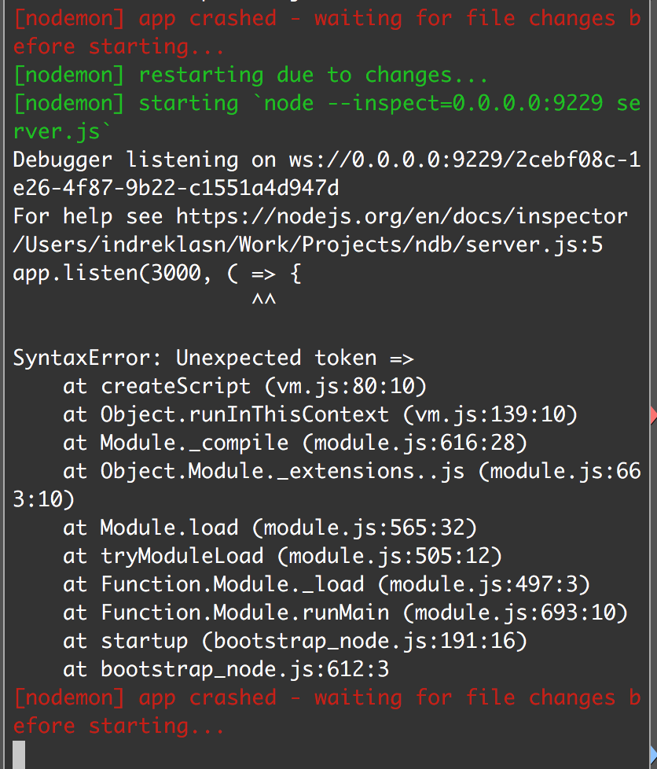
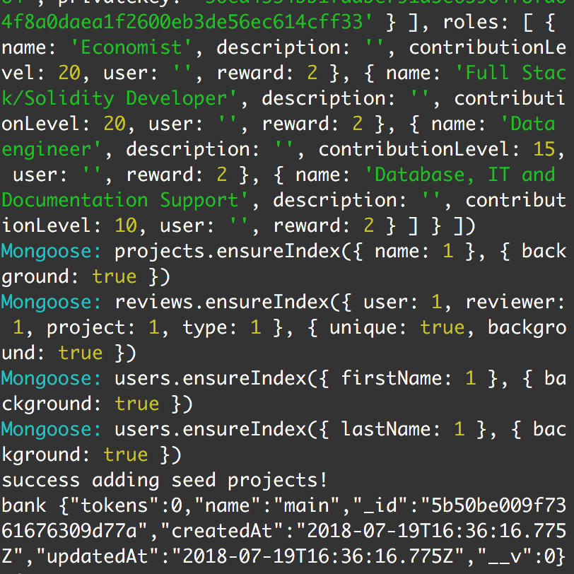
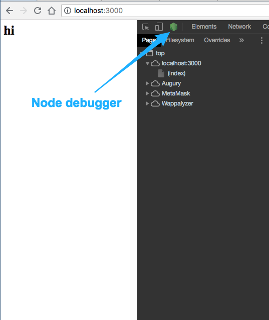
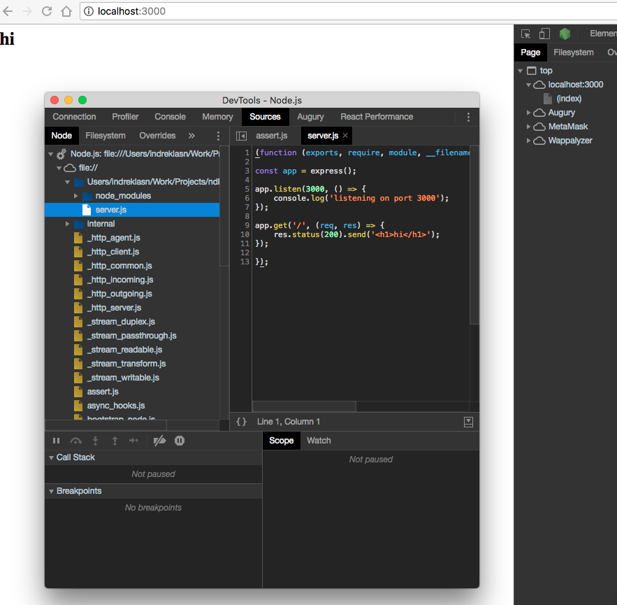
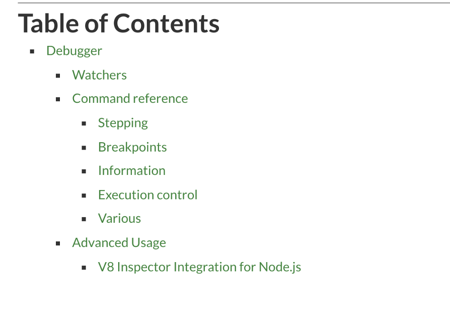
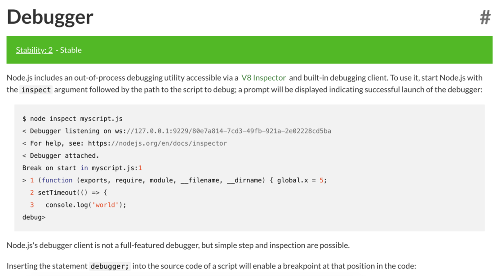
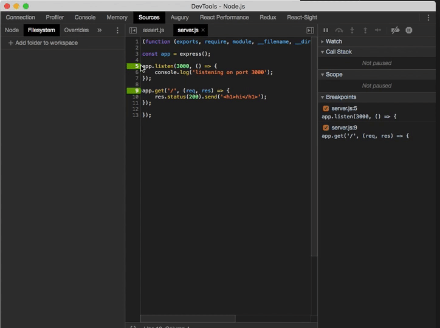
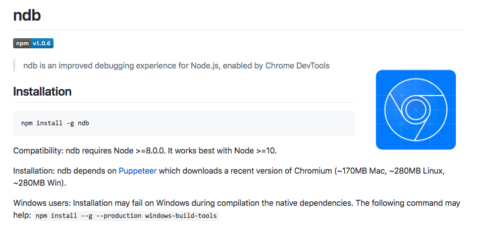
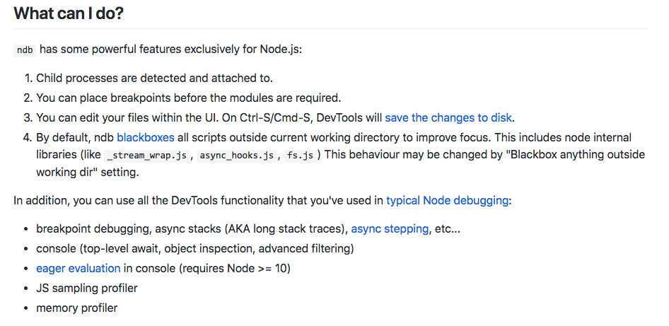
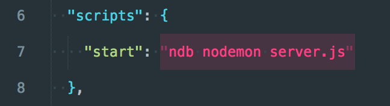

当通过打印日志调试不太够用的时候：


### 当你看见这种情况你怎么做？


你可能会逐行代码去检查来找出错误，如果没有找到，你可能会用`console.log`来查看代码的一些运行输出，这是很痛苦的一件事情，那么有没有其他更好的方法呢？

### 用`console.log`来调试 JavaScript 服务端代码是非常古老的方法

`console.log`是完全不够用的，他需要我们逐行的调试，并且每一次都要重启我们的服务。打印日志的调试代码也会影响我们代码的结构性，它是没有必要的代码，我们还要花些功夫移除它。

例如：

> 需要花多少精力才能从日志中找出我们需要的信息和执行过程？
> 
> 这看着就让人头疼，这不是一个好的方法！

一个更有效更好的方法应该是断点调试。对于断点调试，我们可以通过步入堆栈信息和事件循环来找到问题。

你如果明白了这个方法，哪就来看看其他的选择，有哪些选择？我很高心你能这么问我！

## Node 本身构建了 inspector

对的，Node 确实本身就[构建了 inspector](https://nodejs.org/zh-cn/docs/guides/debugging-getting-started/),node 的 inspector 使用了 V8 的调试协议视图。

让我给你试试，新建一个 node 项目

```bash
mkdir node-debugging && cd node-debugging && npm init -y  && npm install express nodemon && touch server.js
```

开始我们的项目，然后安装 express 和 nodemon：

```bash
node server.js
```

现在我们有了一个 express 基础服务，但是我们不是用传统的方法`node server.js`来启动服务，我们添加一个额外的阐述到我们的命令行，`--inspect`来通知 node 暴露这个新的 debugger 协议。

一旦我们用 inspectoor 的方式来启动服务，这儿就会有一个输出：

对的，他开始工作了！用 chrome 来打开`http://localhost:3000`这个链接，在开发者工具里面，有没有观察到额外的一个东西？

node 存在在我们的浏览器里面？确实！我们任然可以使用我们的 app 像之前一样——`localhost:3000`.  
`http://0.0.0.0:9229/`端口是为开发者提供的。


## Node 的 Inspector 做了什么？

node 的 Inspector 让你用开发者工具用户界面直接调试 node，他可以直接连接到 node 的运行进程！


如果你知道他在 Firefox 和 Safari 中是怎么工作的，那我们来一起讨论讨论。

## 使用 debugger

使用 node 的 debugger 和使用 chrome 客户端的开发者工具类似，设置断点、执行代码、步入断点、找出 bug。

你可以想想这个是多么的有用，如果我们有一个错误在一个大的 controller 里面！我们可以通过这个 debugger，查看调用堆栈、作用域、环境变量，全局变量等等，这是很有用的一个工具！

## 试试例外一个工具

然而我们并没有止步，在 2018 年七月 20 号对于调试 node 是特别的一天。
为甚？
谷歌 chrome 实验室团队，开源了他们先进的调试工具：[ndb](https://github.com/GoogleChromeLabs/ndb)

Ndb 对于调试是一个好的调试工具。来看一下。


### 安装 ndb

```bash
npm install -g ndb
```

就和其他的 npm 包一样，只需要安装就可以开始使用。

### 使用

使用 ndb 的时候，只需要在命令行前面 加上 ndb 就好。

让我们重启服务——注意我们使用的 nodemon——和其他传统项目一样。

我们有了一个单独的 chrome 实例来调试 node，多棒！

我们甚至可以拿到 node 的 process 全局对象——就好比它是 node 的`window`对象。
