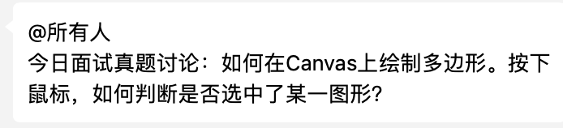
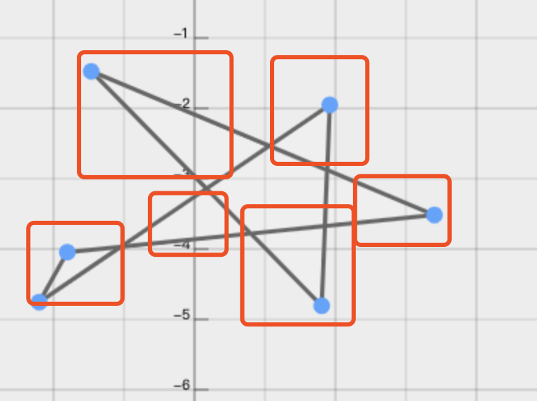
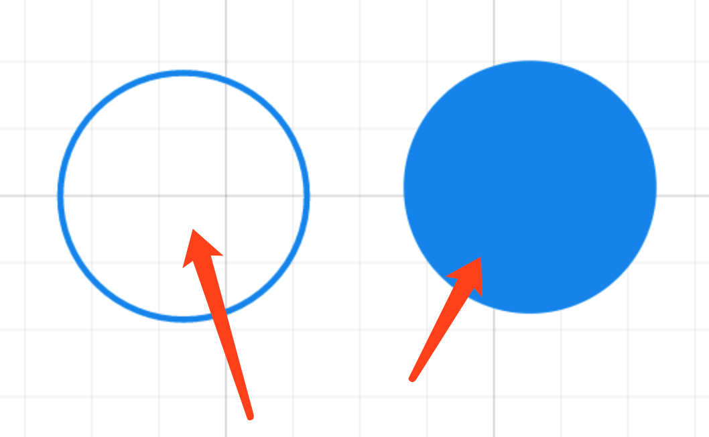
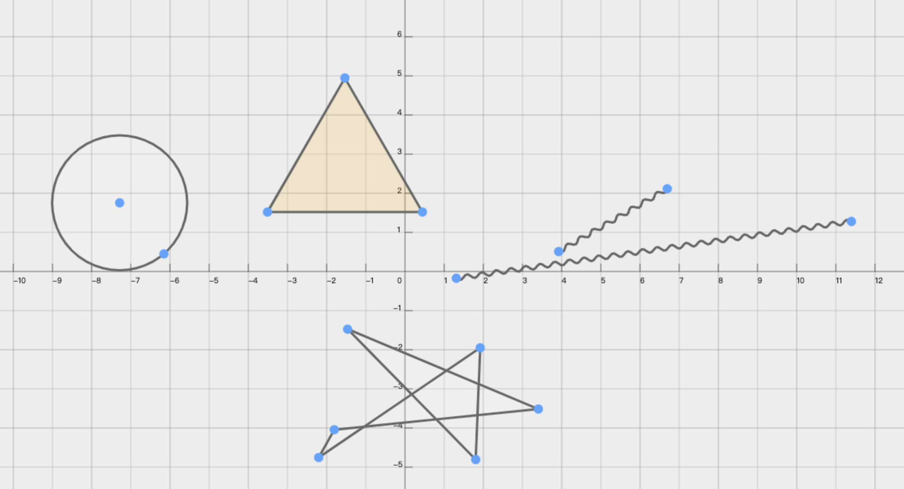
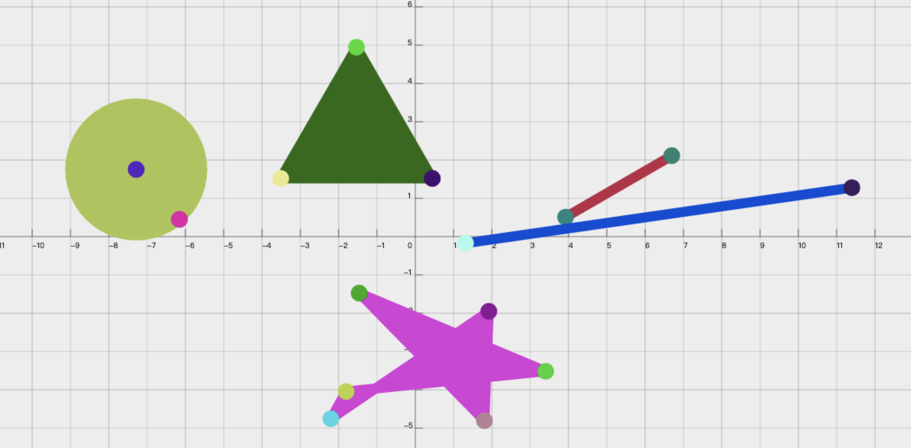

## 起因

首先上图：

今天，我们前端群问了一个这样的问题，然后就开始了激烈的讨论。  
那么下面咱们一起来看看这个问题，这个问题问了两个小问题：

> 1.如何在 canvas 上绘制多边形?  
> 2.鼠标怎么选中绘制的某一个图形？

那么咱们就来分为两个问题解答：

## 绘制多边形

要绘制一个多边形，多边形图形的基本元素是路径。路径是通过不同颜色和宽度的线段或曲线相连形成的不同形状的点的集合。一个路径，甚至一个子路径，都是闭合的。使用路径绘制图形需要一些额外的步骤。

- 首先，你需要创建路径起始点
- 然后你使用画图命令去画出路径。
- 之后你把路径封闭
- 一旦路径生成，你就能通过描边或填充路径区域来渲染图形。
  以上这些步骤会用到一些 API:

> **beginPath()**  
> 新建一条路径，生成之后，图形绘制命令被指向到路径上生成路径。

> **closePath()**  
> 闭合路径之后图形绘制命令又重新指向到上下文中。

> **stroke()**  
> 通过线条来绘制图形轮廓。

> **fill()**  
> 通过填充路径的内容区域生成实心的图形。

### 详解绘制过程

这里详细解答一下绘制的过程：  
第一步，生成路径，调用 beginPath，本质上路径是有很多子路径所构成的，这些子路径全部在一个列表里面，所有的子路径（线、弧）构成图形。而每次调用这个方法之后，列表都会被重置，然后就可以绘制新的图形。(你需要在设置路径之后指定你的起始位置)  
第二步，调用指定函数绘制路径  
第三步，闭合路劲 closePath(不是必须的)

### 笔式绘图仪模型

**绘制一个三角形例子：**

```javascript
var ctx = canvas.getContext("2d");
ctx.beginPath(); //开始路径
ctx.moveTo(75, 50); //指定起始位置
ctx.lineTo(100, 75); //绘制到这个位置的一条线
ctx.lineTo(100, 25); //绘制到这个位置的一条线
ctx.fill(); //填充图形，默认就制动结束路径了
```

在这个过程中，有一个比较有用的函数，moveTo,这个函数实际上画不出来任何东西，它是属于上面描述的路劲列表的一部分。  
看下这个函数的作用：

> **moveTo()**  
> 将笔触移动到指定的坐标 x 以及 y 上。

当 canvas 初始化或者 beginPath()调用后，你通常会使用 moveTo()函数设置起点。我们也能够使用 moveTo()绘制一些不连续的路径。

这个时候你可以想象一下在纸上画东西，笔尖从一个点到另一个点的移动过程。这个过程的模式叫做**笔式绘图仪模式**。 所以 canvas 2d 绘图的模式也就是这种模式。

现在绘制多边形就没有什么问题了。

## canvas 上找出指定的图形

首先，完成描述一下这个问题：
按下鼠标，如何判断出选中了某一个图形？  
比如下图：

鼠标点击了这个不规则多边形的内部，怎么判断？

第一反应就是 isPointInPath，或者是迭代所有图形，拿鼠标的点去与图形的点碰撞检测，这个方法可以用，但是适用场景比较少，还有就是性能开销比较大，如果图形太多，每一个都需要经过计算，那么这个交互会变得非常的不友好。  
有没有其他方案了，在游戏界有一个普遍使用的方案——包围盒，什么是包围盒呢？我们以上面的图形举例，外面画的红线框就是这个多边形的包围盒，很形象的一个例子，就是公司发的月饼盒子，就是里面圆圆的月饼 🥮 的包围盒。  
包围盒的方案有个缺点，选取的范围比较粗。比如上图的红框，框选了不是多边形部分的内容。如果你想用包围盒的方案来做，那就要分的足够细，比如下图：

分出来了多个包围盒，这种情况在图形特别复杂的时候，包围盒这个方案就有点粗糙了。  
还有下图这种，实心和空心圆，用包围盒也就非常的不友好。

那怎么办？

### 方案

如果想要快速选中某一个图形，我们能不能对我们的每一个图形有一个对应的 hash，而在鼠标点击的时候，又能够取到这个 hash。用 hash 的值，去找这个图形,这个过程的时间复杂度是 O(1)。

比如在画布的这些图形：

在另一张一模一样的画布上，画了这些图形

上层画布（显示出来的）是正常的图形，但是每个图形分配一个 rgb 色值。  
下层画布（隐藏）用这个 rgb 色值做填充或者 stroke。  
当鼠标点击的时候，在隐藏画布相同的位置，取一个像素点。

而这个像素点的 rgb 值就是 我们要找的 hash。
